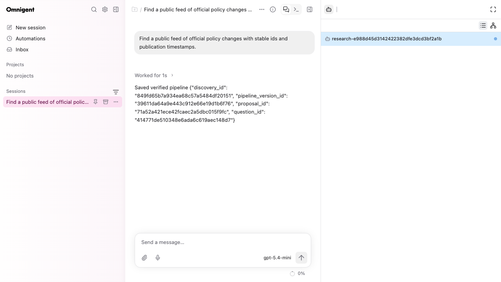
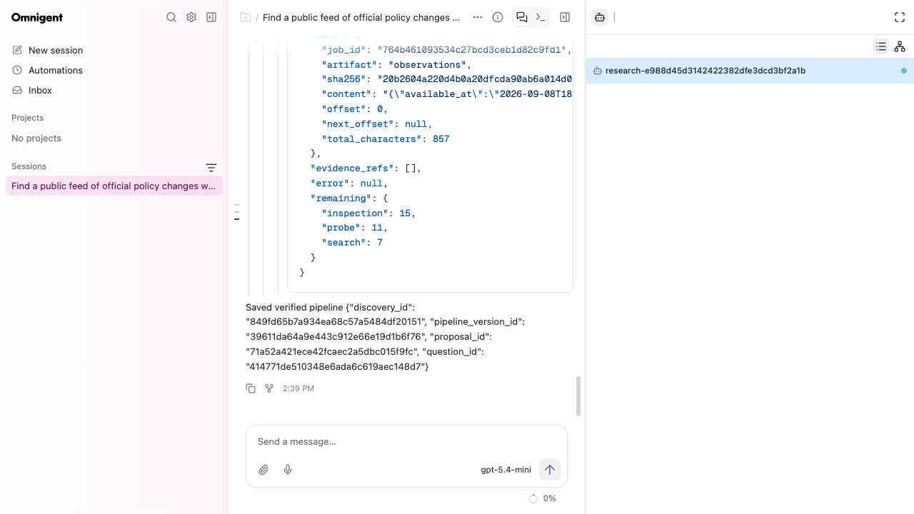

# Omnigent browser acceptance

On September 8, 2026, a Playwright browser completed the research workflow through the pinned Omnigent UI, server, runner, and Research Harness MCP server. Model responses were deterministic HTTP fixtures; the source feed and detached collection/export workers used real local HTTP and subprocesses. No paid provider calls were made.

The browser opened the authored research session, submitted the policy brief in chat, and received backend-issued proposal and pipeline ids. A second chat message requested collection and export. Expanding the tool calls exposed the export's content, source URL, capture id, source-run id, and body/configuration hashes.

After stopping and restarting the full server and runner, reloading the page restored the same conversation and session id. A new chat message retrieved the existing jobs and read the same export. Read-only database snapshots before and after that lookup matched: two succeeded jobs, one collection run, one source run, one capture, one observation, and one version. No duplicate publication occurred.

The [machine-readable acceptance record](assets/omnigent-ui-acceptance.json) contains the case/job ids, checks, row counts, screenshot hashes, and usage limitations. Full local browser snapshots and screenshots were saved under output/playwright/; the runtime artifacts were saved at /tmp/rh-omnigent-ui. Those directories are local artifacts, not required files in a clone.

To reproduce the interactive fixture, first follow the pinned setup in [examples/omnigent](../examples/omnigent/README.md), then run:

~~~sh
uv run --extra mcp python examples/omnigent/normal_runtime_fixture.py \
  --out /tmp/research-browser-case \
  --omnigent-python /tmp/researchharness-omnigent-be042b39/.venv/bin/python \
  --interactive
~~~

The fixture writes runtime-ready.json with its URL and session id. Open that session and send the brief. Set control.json to {"mode":"collection"} before requesting collection/export. After the turn is idle, set {"mode":"reopen"} and create the restart sentinel file. Wait for runtime-ready.json's generation to increase, reload, and request the saved jobs/export. Creating the stop sentinel exports traces and closes the fixture. These controls exist only in the offline fixture.

This verifies browser routing, tool visibility, saved state, and recovery. It does not measure live model source selection or response quality. The fixture intentionally returns a short fixed final response rather than exercising a generated research summary. Omnigent's optional resources/github request returned 404 in the console; research operations succeeded. UI turns are recorded as whole-workflow usage, with auxiliary provider usage still unknown. This browser run preceded the subsequent addition of bundle-digest validation; that guard has its own regression and normal-runner checks.
