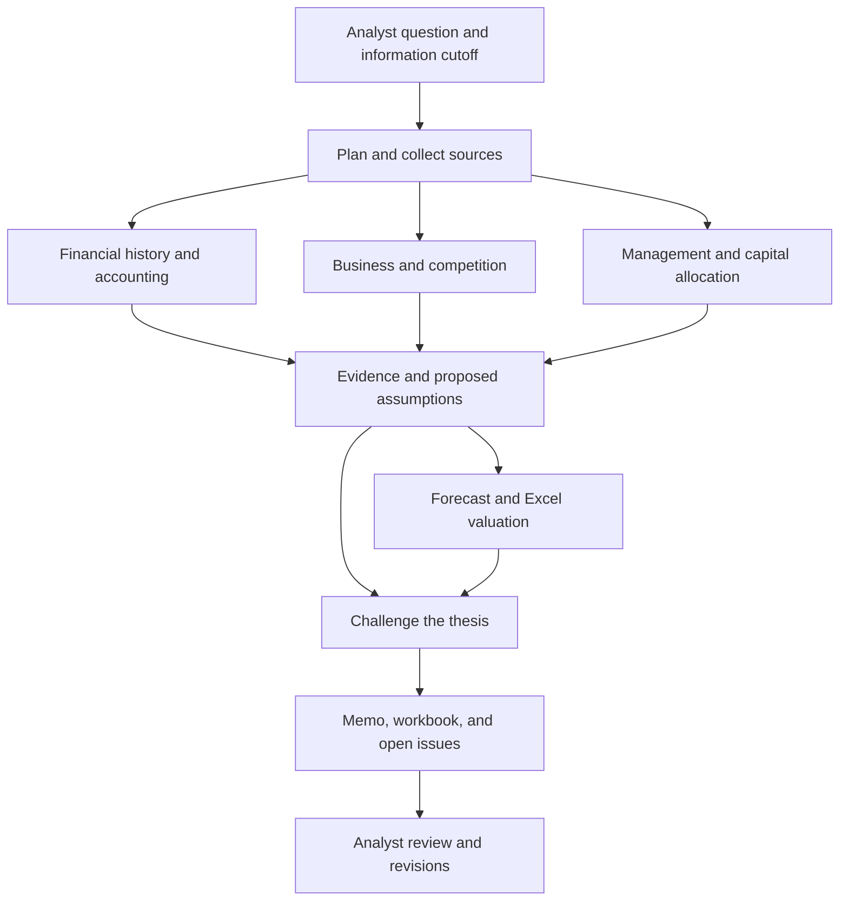

# Finance research workflow and architecture

Proposal dated September 6, 2026, updated after the expanded [analyst-needs research](analyst-needs.md). Product choices remain hypotheses for an analyst pilot. The first product test now prioritizes reviewing an event against established coverage; initiation provides a baseline when the analyst does not already have one.

## The work the product should support

The analyst needs to understand what drives a business, decide which expectations to underwrite, and explain how new evidence changes that view. A useful research case should answer:

1. What must be true for the investment thesis to work?
2. Which facts support or contradict those conditions?
3. Where do our assumptions differ from sourced market expectations?
4. What valuation follows from those assumptions?
5. What evidence would change our mind, and what events could matter next?

Market consensus and expectations inferred from price are different objects. Label each explicitly. When consensus data is unavailable, leave the comparison unresolved rather than inventing an estimate.

There are two promising entry points. **Company initiation** builds a research pack and model for a new idea. **An earnings update** reconciles new information against an existing model and thesis. The expanded product research favors testing an update first with an analyst who maintains existing coverage. Initiation remains a useful technical benchmark and a distinct user workflow.

Competitors advertise substantial overlap across research, models, workflow customization, and decision history. The proposed differentiation requires evidence of a specific gap in the fund's current process. The [market landscape](market-landscape.md) separates documented capabilities, availability questions, and hypotheses to test.

## A company research run

The analyst supplies a company identifier, research question, information cutoff, investment horizon, and available sources. For the update workflow, the analyst also supplies the baseline model and thesis, plus dated expectations when available. For initiation, begin with public information and one US-listed operating business where a conventional enterprise DCF is appropriate; other sectors require their own valuation policies.

The coordinator proposes a bounded research plan. Specialist tasks share a versioned source collection and write structured findings. Valuation depends on reconciled financial inputs and an explicit assumption set. Draft assumptions can support exploratory scenarios, but the final memo must show which assumptions the analyst has accepted.

These are task boundaries. A task can be an agent invocation, a deterministic calculation, or a document retrieval. The coordinator persists state and can resume work after an interruption.

| Responsibility | Concrete work | Required output |
| --- | --- | --- |
| Coordinator | Define questions, dependencies, allowed sources, budgets, and stopping conditions | Task plan and coverage gaps |
| Financials | Reconcile statements, fiscal periods, segments, adjustments, and cash conversion | Financial facts, derivations, and exceptions |
| Business | Investigate revenue drivers, pricing, competition, concentration, and unit economics | Driver map and supported hypotheses |
| Management | Compare dated guidance with outcomes; examine disclosed incentives and capital allocation | Evidence-based execution record and unresolved questions |
| Valuation | Translate scenarios into forecasts and spreadsheet formulas | Editable workbook, input lineage, and calculation results |
| Challenger | Test the strongest thesis claims and expose unsupported assumptions or contrary evidence | Specific objections, source references, and proposed follow-up work |

The coordinator assembles the memo from these artifacts. Management work should explain implications for execution and capital allocation. Missing evidence remains an open question. A challenger should be able to report that a concern is unsupported; its assignment is to test the thesis, not manufacture a bearish story.

## Shared state

Agents should exchange records and artifact references. A source passage can support several claims, and a claim can influence several model inputs. This dependency graph makes changes inspectable.

| Record | Essential fields |
| --- | --- |
| Research case | Company, question, horizon, cutoff, owner, thesis version |
| Source | Document identity, publication/availability time, retrieval time, content hash, location, access scope |
| Financial fact | Metric, value, unit/scale, currency, period start/end, fiscal label, entity/segment, accounting basis, source locator |
| Claim | Statement, supporting and conflicting evidence, assessment, unresolved questions, author/task |
| Assumption | Scenario, driver, value, horizon, rationale, evidence, author, review state, version |
| Model artifact | File/version, template version, formula/input map, calculation engine, calculated outputs, checks |
| Task result | Input versions, findings, evidence references, missing inputs, review issues, artifact references, cost, status |
| Expectations snapshot | Own estimate, broker consensus, or guidance; period, definition, source time, population and dispersion where available |
| Research question | Thesis condition, materiality, evidence needed, prior answers, owner, next review |
| Company relationship | Customer/supplier/peer relationship, supporting evidence, affected drivers, scope and uncertainty |
| Catalyst | Event/date range, confirmed or estimated timing, expected observable result, linked thesis condition |
| Model change | Prior and proposed input/formula, source or rationale, affected outputs, author, analyst disposition |
| Decision record | Dated judgment, model and thesis versions, reasons, expected observable outcomes, subsequent review |

For a reported fact, retain the filing accession and table or passage locator. For a derived fact, retain the expression and references to its inputs. Distinguish reported facts, management guidance, analyst assumptions, and agent inferences in both the memo and workbook.

Example dependency: a filing discloses a higher customer concentration; business research flags renewal risk; the analyst changes a downside revenue assumption; the forecast, valuation, and relevant memo passages become stale until recalculated or reviewed.

Keep both the original and revised versions. Analyst edits take precedence over automated proposals. Disagreements stay visible with their supporting evidence.

## Data and financial correctness

SEC submissions and Company Facts are a practical public starting point. The SEC's XBRL APIs aggregate standard-taxonomy, entity-wide facts; company-specific disclosures and segment detail can require the original filing. They also do not supply a complete research dataset containing prices, consensus estimates, or earnings-call transcripts. Use separate source adapters for those inputs. [SEC EDGAR API documentation](https://www.sec.gov/search-filings/edgar-application-programming-interfaces).

Normalize records explicitly. A value needs its fiscal interval, currency, scale, accounting basis, and consolidation scope. Quarter and year-to-date figures need different treatment. Restatements and amendments create new versions, and a historical run must exclude information published after its cutoff. A missing value is not zero.

Important financial checks include statement reconciliation where the data supports it, explicit non-GAAP adjustment bridges, consistent signs, consistent currency and scale, and documented share-count treatment. Weighted-average shares used for historical EPS cannot silently become the current diluted denominator for equity valuation.

For the initial enterprise DCF, forecast operating drivers and reinvestment explicitly:

`FCFF = EBIT × (1 − operating tax rate) + D&A − capex − change in operating working capital`

Discount these firm cash flows at an appropriate cost of capital, then use an explicit bridge from operating value to common equity. The bridge must document cash and nonoperating assets, debt, other claims, and dilution as applicable. Terminal growth, profitability, and reinvestment assumptions must be mutually consistent. These modeling principles follow the distinction between firm and equity cash flows in [Damodaran's valuation introduction](https://pages.stern.nyu.edu/~adamodar/New_Home_Page/background/valintro.htm) and [cash-flow treatment](https://pages.stern.nyu.edu/~adamodar/New_Home_Page/littlebook/cashflows.htm).

The agent proposes assumptions and explains them; calculation tools produce numerical results. Flag invalid terminal-growth/discount-rate combinations, formula errors, unexplained historical breaks, and a valuation dominated by terminal assumptions. Scenario ranges express assumptions, not statistical confidence intervals.

## Excel integration

For the update pilot, support one existing analyst `.xlsx` layout and make proposed changes reviewable in a new version. If a usable workbook is unavailable, a reviewed template can support an initiation demonstration, but does not validate compatibility with the analyst's actual workflow. Suggested template sheets are Sources, Historicals, Assumptions, Forecast, DCF, Scenarios, and Checks. Historical inputs link to evidence; assumptions retain rationale and author. Calculated cells contain formulas, with results recalculated and checked before delivery.

Expose bounded workbook operations to the valuation agent: inspect, propose a change, apply it to a new version, recalculate, read results, validate, and compare versions. Record both formulas and calculated values. A file that contains formulas but has not been calculated must remain marked as unverified.

Map the initial workbook's inputs and outputs before broadening support to arbitrary workbooks. Preserve analyst formulas and notes, and show changed inputs and their valuation effects. External data links, macros, and custom functions require explicit compatibility testing.

A later Excel add-in can read and write formulas and values through Microsoft's JavaScript API and request recalculation. These are available primitives; a reliable model-editing agent still needs versioning, mapping, and validation around them. [Excel range operations](https://learn.microsoft.com/en-us/office/dev/add-ins/excel/excel-add-ins-ranges-set-get-values), [Excel workbook calculation](https://learn.microsoft.com/en-us/office/dev/add-ins/excel/excel-add-ins-workbooks).

## Runtime and analyst experience

A reasonable local prototype is a Python service with typed records, SQLite for task and research state, and a directory of immutable source and output artifacts. Keep model-provider, data-provider, and spreadsheet-execution interfaces replaceable. Choose specific libraries when implementing the first workflow.

The runtime needs durable task states, dependency checks, schema validation, time and cost limits, bounded retries, cancellation, and event logs. Independent research tasks can execute concurrently. Only the workbook execution service writes a given model version. Resuming a completed task uses its stored result; regenerating an LLM response is a new version, not an identical replay.

When a source or assumption changes, mark downstream records stale and rerun affected tasks. Cache work by input, source, prompt, and tool versions. Preserve material conflicts instead of allowing the synthesis step to silently pick a convenient answer.

The interface should foreground the analyst's question, evidence, assumptions, workbook, and open issues. Show task progress to explain delays and missing inputs. An analyst should be able to open a citation, challenge a claim, edit an assumption, compare scenarios, and see what changed since the previous run.

Before using a fund's internal material, the chosen deployment and connectors need to respect that fund's access boundaries. Keep access scope on the research case and its artifacts. External document content is evidence and cannot grant agents additional tools or authority.

## Build sequence

1. Capture one existing company case: its model, thesis, open questions, dated expectations, and permitted sources. Establish the user's baseline workflow before implementation.
2. Implement one event comparison with normalized facts and explicit source, period, and definition checks. Preserve the pre-event baseline.
3. Produce a reviewable change proposal, a calculated workbook version, and a cited PM brief. Demonstrate persistent analyst edits and consistent downstream outputs.
4. Add bounded business, management, and challenger tasks for unresolved material questions, plus durable resume and dependency invalidation.
5. Test repeated events and extend providers, sectors, valuation methods, and workbook support according to observed gaps. Use initiation to create a new case when required.

A pilot passes when an analyst can verify material claims, reproduce the workbook's outputs, correct an assumption without losing their work, and finish the assignment faster including review and corrections. Agent count and report length are not useful success measures.
